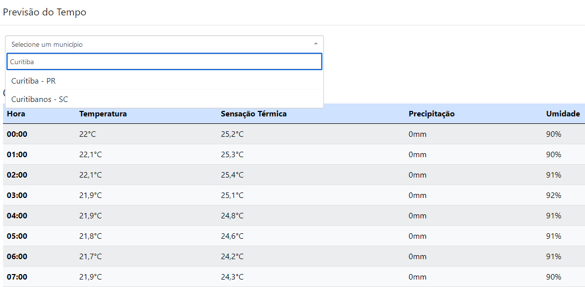

### Objetivos <h3>
Esse projeto tem o objetivo principal de servir como portfólio para demonstrar o uso da linguagem C# com framework ASP.NET Core, seus pacotes e ferramentas.

Também tem o intuito de estudo, desenvolvimento profissional e registro de minha envolução utilizando essas tecnologias. 

### Descrição do projeto <h3>
* Previsão do tempo;
* Através do drop-down list o usuário seleciona um município brasileiro, tendo a opção de pesquisa. O componente utilizado é de terceiro e pode ser encontrado <a href="https://github.com/VirtusX/fstdropdown/">aqui</a>;
* A aplicação busca em um arquivo JSON a latitude e longitude do município selecionado e chama a API <a href="https://open-meteo.com/">Open-Meteo</a> que fornece os dados climáticos;
* Os dados climáticos são apresentados para o usuário.
### Tecnologias utilizadas <h3>
* Aplicação desenvolvida em ASP.NET Core com Razor Pages.
 
<h1 align="center">
  
</h1>